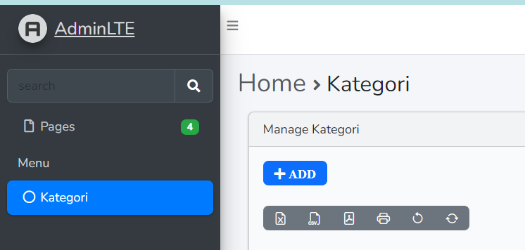
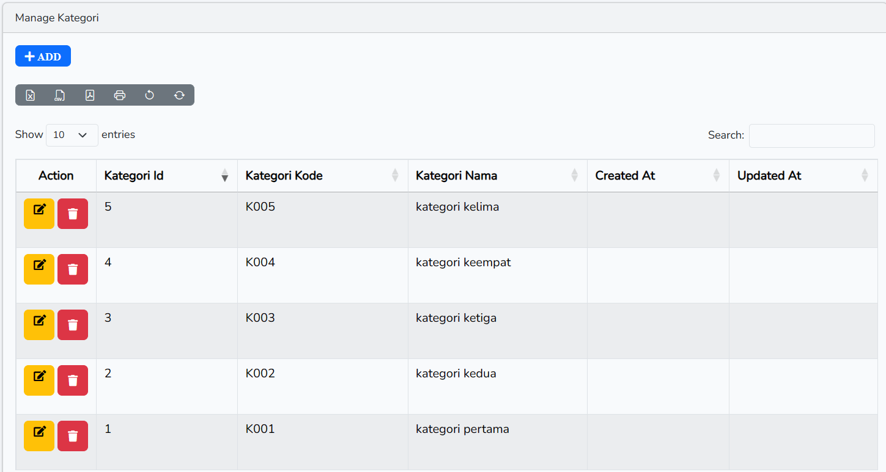
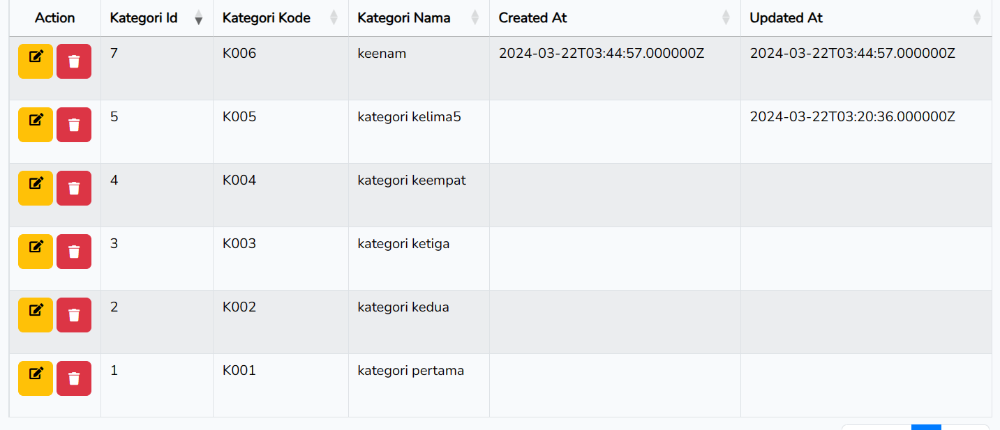

==========================

# LAPORAN PRAKTIKUM

# PEMROGRAMAN WEB LANJUT

# JOBSHEET – 3

==========================

## Nama : Hanief Mochsin

## Kelas : 2F

## Nim : 2241720181

==========================

--Buat project laravel PWL_POS

--Create database phpmyadmin PWL_POS

--Copy file .env.example menjadi .env

--Edit file .env

--Create file dan tabel migration memakai php artisan

--Mengedit file m_level

--Membuat migrasi table

--mengecek table yang masuk di phpmyadmin

--Buat table database dengan migration untuk table m_kategori yang sama-sama tidak
memiliki foreign key

--di migrasi ke phpmyadmin

--pengecekan ke phpmyadmin

--membuat create -m_user table

--edit file migration m_user tabel

--membuat dan mengedit file migration m_barang, t_penjualan, t_stok, t_penjualan_detail

--mengecek di localhost phpmyadmin

--membuat seeder LevelSeeder dengan php artisan

--seeding database ke table m_level

--membuat file user seeder

--seeding class user

--mengecek kolom table user di phpmyadmin

--seeder kategori, barang, stok, penjualan, detail penjualan
--

--

--

--