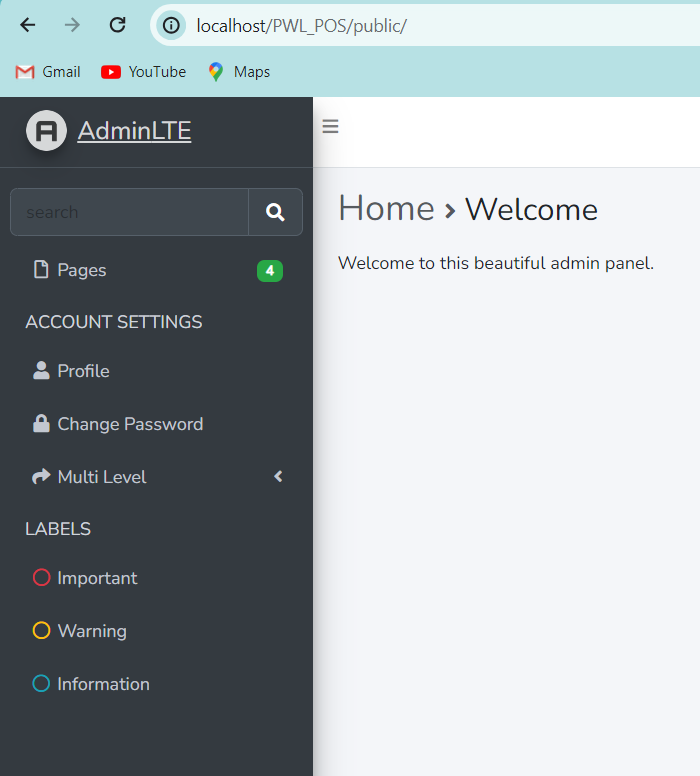

==========================

# LAPORAN PRAKTIKUM

# PEMROGRAMAN WEB LANJUT

# JOBSHEET – 3

==========================

## Nama : Hanief Mochsin

## Kelas : 2F

## Nim : 2241720181

==========================

--Buat project laravel PWL_POS

--Create database phpmyadmin PWL_POS

--Copy file .env.example menjadi .env

--Edit file .env

--Create file dan tabel migration memakai php artisan

--Mengedit file m_level

--Membuat migrasi table

--mengecek table yang masuk di phpmyadmin

--Buat table database dengan migration untuk table m_kategori yang sama-sama tidak
memiliki foreign key

--di migrasi ke phpmyadmin

--pengecekan ke phpmyadmin

--membuat create -m_user table

--edit file migration m_user tabel

--membuat dan mengedit file migration m_barang, t_penjualan, t_stok, t_penjualan_detail

--mengecek di localhost phpmyadmin

--membuat seeder LevelSeeder dengan php artisan

--seeding database ke table m_level

--membuat file user seeder

--seeding class user

--mengecek kolom table user di phpmyadmin

--seeder kategori, barang, stok, penjualan, detail penjualan
--

--

--

--

--

--insert data baru ke table m_level menggunakan controller

--update data baru ke table m_level menggunakan controller

 

--menghapus data cus dari m_level

-- menampilkan data dari table m_level lewat views menggunakan controller

-- insert data table m_kategori

-- update data

--snack menjadi cemilan

--hapus data cemilan 

--kategori cemilan telah terhapus

--menampilkan data table kategori dari database

--menampilkan semua data di table user

--menambahkan beberapa data akan tetapi saat ditampilkan password tidak dimunculkan 

-- menambah data pelanggan

-- mengubah data pelanggan menjadi data pelanggan pertama

## TUGAS PERTANYAAN
### 1. Pada Praktikum 1 - Tahap 5, apakah fungsi dari APP_KEY pada file setting .env Laravel?
### 2. Pada Praktikum 1, bagaimana kita men-generate nilai untuk APP_KEY?
### 3. Pada Praktikum 2.1 - Tahap 1, secara default Laravel memiliki berapa file migrasi? dan untuk apa saja file migrasi tersebut?
### 4. Secara default, file migrasi terdapat kode $table->timestamps();, apa tujuan/output dari fungsi tersebut?
### 5. Pada File Migrasi, terdapat fungsi $table->id(); Tipe data apa yang dihasilkan dari fungsi tersebut?
### 6. Apa bedanya hasil migrasi pada table m_level, antara menggunakan $table->id(); dengan menggunakan $table->id('level_id'); ?
### 7. Pada migration, Fungsi ->unique() digunakan untuk apa?
### 8. Pada Praktikum 2.2 - Tahap 2, kenapa kolom level_id pada tabel m_user menggunakan $tabel->unsignedBigInteger('level_id'), sedangkan kolom level_id pada tabel m_level menggunakan $tabel->id('level_id') ?
### 9. Pada Praktikum 3 - Tahap 6, apa tujuan dari Class Hash? dan apa maksud dari kode program Hash::make('1234');?
### 10. Pada Praktikum 4 - Tahap 3/5/7, pada query builder terdapat tanda tanya (?), apa kegunaan dari tanda tanya (?) tersebut?
### 11. Pada Praktikum 6 - Tahap 3, apa tujuan penulisan kode protected $table = 
### ‘m_user’; dan protected $primaryKey = ‘user_id’; ?
### 12. Menurut kalian, lebih mudah menggunakan mana dalam melakukan operasi CRUD ke database (DB Façade / Query Builder / Eloquent ORM) ? jelaskan

--jawab

-- 1. APP_KEY pada file .env Laravel merupakan kunci enkripsi yang digunakan untuk mengamankan data sensitif.

-- 2. APP_KEY bisa digenerate dengan menjalankan perintah `php artisan key:generate`.

-- 3. Secara default, Laravel memiliki satu file migrasi yang biasa digunakan untuk membuat tabel pengguna (users).

-- 4. Fungsi timestamps() digunakan untuk secara otomatis menyimpan waktu pembuatan dan pembaruan setiap entri dalam tabel.

-- 5. Fungsi $table->id() menghasilkan tipe data kolom auto increment yang bisa bertambah otomatis.

-- 6. Penggunaan $table->id() dan $table->id('level_id') menghasilkan hasil yang sama, yaitu kolom auto increment dengan nama level_id.

-- 7. Fungsi ->unique() digunakan untuk memastikan bahwa nilai dalam kolom tertentu adalah unik.

-- 8. Penggunaan $tabel->unsignedBigInteger('level_id') dan $tabel->id('level_id') berbeda karena yang pertama adalah tipe data unsigned big integer sedangkan yang kedua adalah pembuatan kolom auto-incrementing.

-- 9. Class Hash digunakan untuk mengenkripsi kata sandi. 

-- 10. Tanda tanya (?) pada query builder digunakan untuk menandai parameter yang akan diikuti oleh nilai, berguna untuk mencegah SQL injection.

-- 11. Penulisan kode protected $table = 'm_user'; dan protected $primaryKey = 'user_id'; digunakan untuk menentukan nama tabel dan primary key yang digunakan oleh model.

-- 12. Penggunaan Eloquent ORM lebih mudah dalam melakukan operasi CRUD karena abstract yang diberikan serta Query Builder dan DB Façade. Eloquent ORM menyediakan sintaks yang lebih dekat dengan bahasa pemrograman dan developer untuk berinteraksi dengan database menggunakan objek-objek model yang banyak.