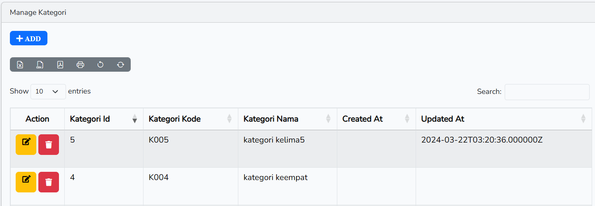

==========================

# LAPORAN PRAKTIKUM

# PEMROGRAMAN WEB LANJUT

# JOBSHEET – 4

==========================

## Nama : Hanief Mochsin

## Kelas : 2F

## Nim : 2241720181

==========================

## PRAKTIKUM

--mendaftarkan atribut m_user ke database

-- yang terjadi adalah menambahkan data baru lagi yaitu manager 3

--retrieve data dengan metode find

--mengambil data dengan level id 1 diambil yang pertama

\

--hasilnya sama seperti sebelumnya akan tetapi method firt nya digabung dengan where

--hasilnya akan menampilkan retrieve data yang diambil. apabila data yang diambil tidak sesuai atau tidak ada di kolom tabel maka akan menampilkan abort(404)

--berikut hasil error 404 apabila menginputkan data yang salah ataau tidak ada di kolom tabel

--penggunaan findOrFail

--hasil apabila retrieve data fail

