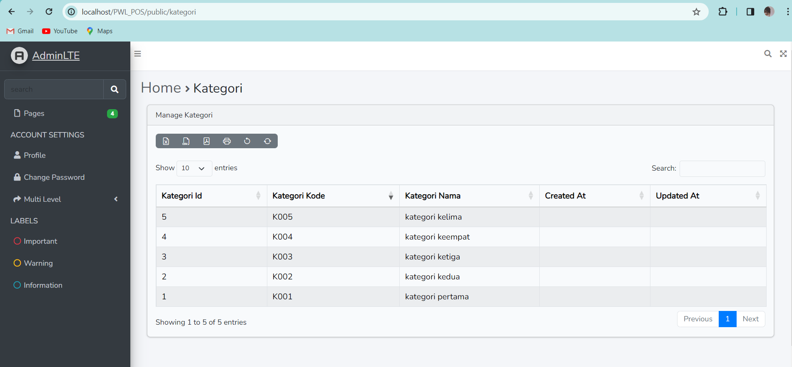
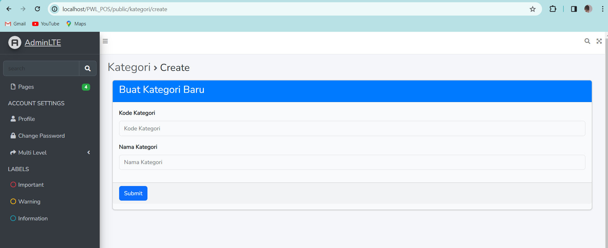

==========================

# LAPORAN PRAKTIKUM

# PEMROGRAMAN WEB LANJUT

# JOBSHEET – 4

==========================

## Nama : Hanief Mochsin

## Kelas : 2F

## Nim : 2241720181

==========================

## PRAKTIKUM

--mendaftarkan atribut m_user ke database

-- yang terjadi adalah menambahkan data baru lagi yaitu manager 3

--retrieve data dengan metode find

--mengambil data dengan level id 1 diambil yang pertama

\

--hasilnya sama seperti sebelumnya akan tetapi method firt nya digabung dengan where

--hasilnya akan menampilkan retrieve data yang diambil. apabila data yang diambil tidak sesuai atau tidak ada di kolom tabel maka akan menampilkan abort(404)

--berikut hasil error 404 apabila menginputkan data yang salah ataau tidak ada di kolom tabel

--penggunaan findOrFail

--hasil apabila retrieve data fail

--ketika melakukan count tampilah browser hanya menampilkan sebuah attention di usercontroller baris 15

--mengubah tampilan view agar dapat menampilkan count dari jumlah pengguna berdasarkan level id tabel user

--disini menggunakan method firstOrCreate maka apabila data ditemukan maka akan ditampilkan apabila tidak ketemu maka akan di inssert ke dalam tabel, berhubung disini data nya ketemu maka hasilnya akan ditampilkan ke web dan tidak menambahkan data apapun ke tabel

--disini ditampilkan manager dua dua yang sebelumnya tidak ada di dalam kolom tabel maka akan di tambahkan ke dalamnya

--disini menggunakan method firstOrNew sedangkan data yang diambil sudah tersedia di tabel maka hanya menampilkan data yang diambil saja

--sama seperti sebelumnya pada method ini menampilkan data manager 33 yang sebelumnya tidak ada di kolom tabel maka sekaligus ditambahkan ke dalam tabel user di database

--lalu agar method create dan new tadi bisa tersimpan maka digunakan lah method save agar tersimpan dengan baik di dalam database.

--pada tampilan web hanya mengembalikan code dump pada percobaan praktikum yaitu mengembalikan nilai method isdirty yang menghasilkan false

--berikut ketika menampilkan data manager55 yang sebelum nya tidak ada akan ditambahkan dengan create melalui isdirty dan isclean

--pada code dump yang diberikan mengembalikan nilai false dari nama dan username karena username tidak berubah

--membuat halaman CRUD

--menampilkan fitur tambah user pada view user

--ketika menjalankan di browser

--dan klik tombol tambah, lalu setelah menginputkan form dan klik simpan maka akan langsung tersimpan di database

--lalu mengubah salah atu data diatas

--klik tombol ubah pada salah satu data

--lalu ubah sesuai keinginan kita

--isi form untuk mengubahnya

--setelah diubah

--lalu fitur untuk menghapus salah satu data, contohnya managerku123 akan dihapus, maka didalam kolom tabel akan terhapus

--menggunakan method belongsto untuk menampilkan seluruh data kolom tabel user

